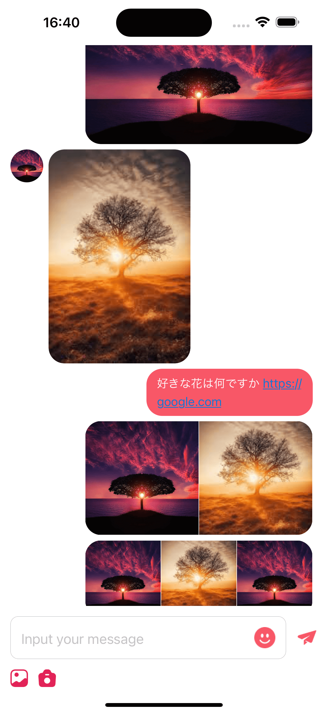
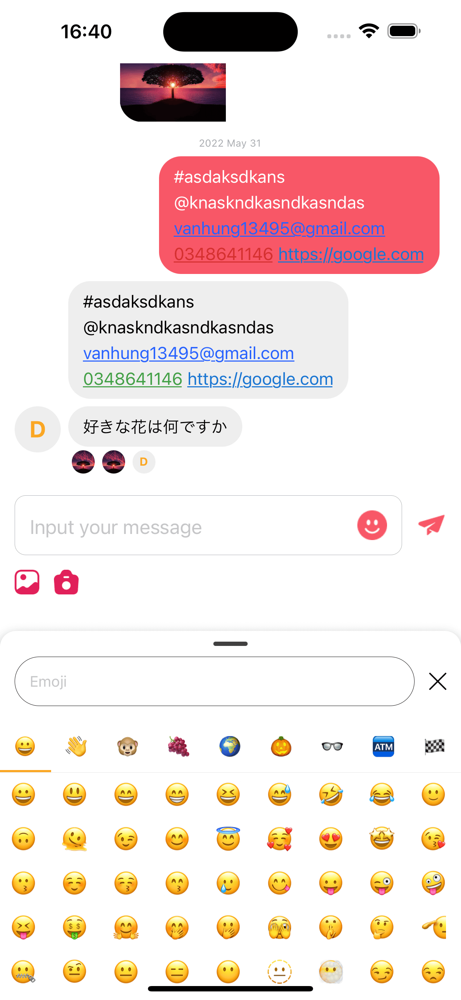

# react-native-messy

Chat ui for React Native
<p>
    
  
</p>

## Dependency

- [discord/bottom-sheet](discord/react-native-bottom-sheet#discord-fork-4.6.1-rngh-v2)
- [react-native-keyboard-controller](https://kirillzyusko.github.io/react-native-keyboard-controller/)
- [react-native-image-picker](https://github.com/react-native-image-picker/react-native-image-picker)
- [react-native-gesture-handler](https://github.com/software-mansion/react-native-gesture-handler#readme)
- [react-native-reanimated](https://github.com/software-mansion/react-native-reanimated#readme)
- [react-native-tab-view](https://reactnavigation.org/docs/tab-view/)
- [react-native-video](https://github.com/TheWidlarzGroup/react-native-video)
- [@shopify/flash-list](https://shopify.github.io/flash-list/)

## Installation

```sh
npm install @vokhuyet/react-native-messy
```

or

```sh
yarn add @vokhuyet/react-native-messy
```

## Usage

```ts
import { Messy } from '@vokhuyet/react-native-messy';

// ...
    const [list, setList] = useState([]);

    <Messy
       messages={list}
        loading={isLoading}
        BaseModule={{
          Cache: CacheDimension,
          Image: ChatListImage,
          Text: AppText,
        }}
        renderLoading={renderLoading}
        renderMessageSystem={ChatListMessageSystem}
        listProps={{
          onEndReached,
          ListHeaderComponent: ChatListHeader,
        }}
        messageProps={{
          hideOwnerAvatar: true,
          hidePartnerAvatar: false,
          onPress: onPressMessage,
          onLongPress: onLongPressMessage,
        }}
        user={{id: account?.user?.id}}
        footerProps={{
          onSend,
          ExtraLeft: <ChatListExtraLeft />,
          ExtraActionLeft: <ChatListExtraActionLeft />,
        }}
    />
```

## Object Type

### TMessyMessageLocation

```typescript
  name: string;
  image: ImageProps['source'];
  latitude: string;
  longitude: string;
```

### TMessyMessage

```ts
  id?: string | number | null;
  text?: string;
  image?: ImageSourcePropType;
  video?: { uri: string };
  audio?: {uri: string}; // not implemented, you can implement by yourself
  location?: TMessyMessageLocation;
  user?: TUser;
  type?: 'system' | 'message';
  createdTime?: Date | number | string;
  status?: 'sending' | 'sent' | 'seen';
  seenBy?: TUser[];
  local?: Asset;
  clientId?: string; // used for display message in List before receiving response from Server
  category?: string; // used for display multiple type of system message
```

### TColor

```ts
  background: string;
  primary: string;
  accent: string;
  placeholder: string;
  shadow: string;
  success: string;
  message_left: {
    background: string;
    text: string;
    link: string;
    email: string;
    phone: string;
    audio: string;
  };
  message_right: {
    background: string;
    text: string;
    link: string;
    email: string;
    phone: string;
    audio: string;
  };
  input: {
    text: string; //text color in TextInput
  };
```

### TUser

```ts
  id: string | number | null | undefined;
  userName?: string | null;
  avatar?: ImageSource;
```

### TMessyFooterProps

```ts
  onSend?: (message?: TMessyMessage) => Promise<void> | void;
  inputProps?: TextInputProps;
  ExtraLeft?: React.ReactNode;
  ExtraActionLeft?: React.ReactNode;
  renderFooter?: FC<TMessyFooterProps>;
```

### TMessageProps

```ts
  hideOwnerAvatar: boolean;
  hidePartnerAvatar: boolean;
  onPress?: (message: TMessyMessageProps) => Promise<void> | void;
  onLongPress?: (message: TMessyMessageProps) => Promise<void> | void;
```

### TBaseModule

```ts
  Image?: FC<ImageProps>;
  Text?: FC<TextProps>;
  Video?: FC;
  Cache: {
    get: (key: string) => any;
    set: (key: string, value: any) => void;
  };
```

## Props

- ```loading```(boolean): loading status
- **```messages```**([TMessyMessage[]](#tmessymessage)): list of messages
- ```user```([TUser](#tuser)): sender information;
- ```theme```: ([TColor](#tcolor)): custom theme for message;
- ```footerProps```([TMessyFooterProps](#tmessyfooterprops)):  Custom props for Element below list messages;
- ```listProps```(TListProps): custom flatlist props;
- ```messageProps```([TMessageProps](#tmessageprops)): ;
- ```parsedShape```([ParseShape[]](https://github.com/taskrabbit/react-native-parsed-text)): Custom parse patterns for react-native-parsed-text ;
- ```showDateTime```(boolean): show created time of message;
- ```renderLoading```(FC<{}>): component when loading list message;
- ```renderMessageSystem```(FC<{ data?: TMessyMessage }>): custom system message;
- ```renderMessage```((data: TMessyMessageProps) => JSX.Element): custom whole message item view;
- ```renderAvatar```FC<{ user?: TUser }>: custom ;
- ```renderMessageText```((data: TMessyMessageProps) => JSX.Element): custom text message;
- ```renderMessageAudio```(data: TMessyMessageProps) => JSX.Element;
- ```renderMessageImage```(data: TMessyMessageProps) => JSX.Element;
- ```renderMessageVideo```(data: TMessyMessageProps) => JSX.Element;
- ```renderMessageDateTime```((data: TMessyMessage) => JSX.Element): custom datetime value in message item
- ```renderMessageLocation```: (data: TMessyMessageProps) => JSX.Element;
- ```BaseModule```([TBaseModule](#tbasemodule));

## Contributing

See the [contributing guide](CONTRIBUTING.md) to learn how to contribute to the repository and the development workflow.

## License

MIT

---

Made with [create-react-native-library](https://github.com/callstack/react-native-builder-bob)
